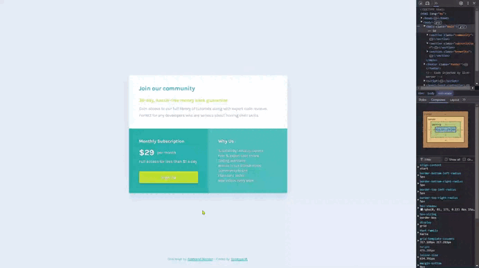

# Frontend Mentor - Single price grid component solution

This is a solution to the [Single price grid component challenge on Frontend Mentor](https://www.frontendmentor.io/challenges/single-price-grid-component-5ce41129d0ff452fec5abbbc). Frontend Mentor challenges help you improve your coding skills by building realistic projects. 

## Table of contents

🔳 [The challenge](#the-challenge-muscle)

🔳 [Screenshots](#screenshots-camera)

🔳 [Links](#links-link)

🔳 [Built with](#built-with-hammer_and_pick)

🔳 [Author](#author-beginner)

## The challenge :muscle: 

Users should be able to:

🎯 View the optimal layout for the component depending on their device's screen size.

🎯 See a hover state on desktop for the Sign Up call-to-action.

## Screenshots :camera:

### Links :link:

[Solution in Frontend Mentor](https://www.frontendmentor.io/solutions/single-price-grid-component-using-grid-1jS9_URBYS) 👈

[Live site URL here](https://mendezpvi.github.io/fem-single-price-grid/) 👈

## Built with :hammer_and_pick:

📌 Semantic HTML5 markup

📌 CSS custom properties

📌 Flexbox

📌 CSS Grid

📌 Mobile-first workflow

## Author :beginner:

✨ Frontend Mentor - [@mendezpvi](https://www.frontendmentor.io/profile/mendezpvi)

✨ X-Twitter - [@mendezpvi](https://x.com/mendezpvi)
